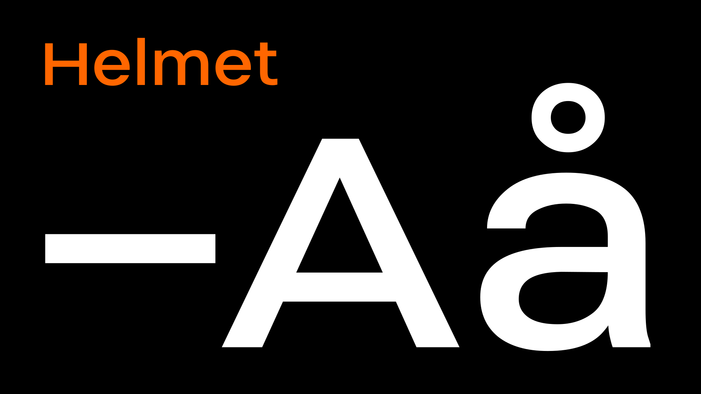
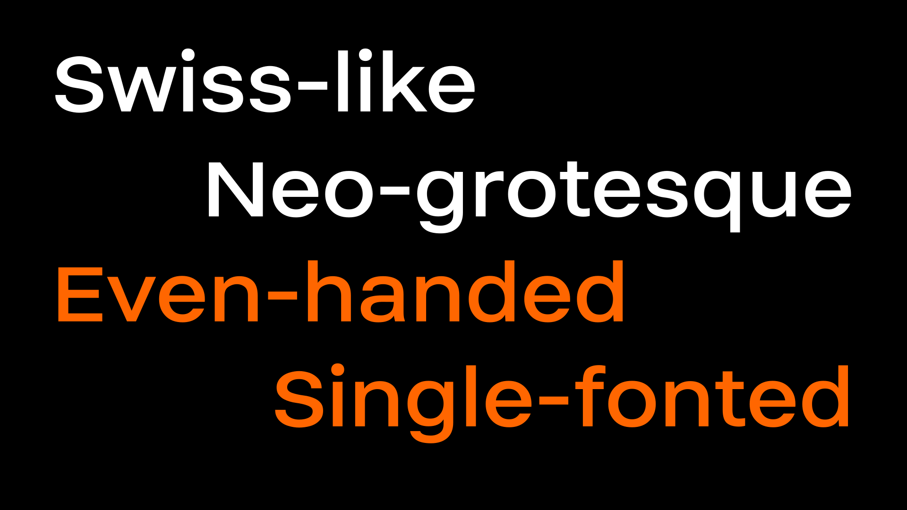
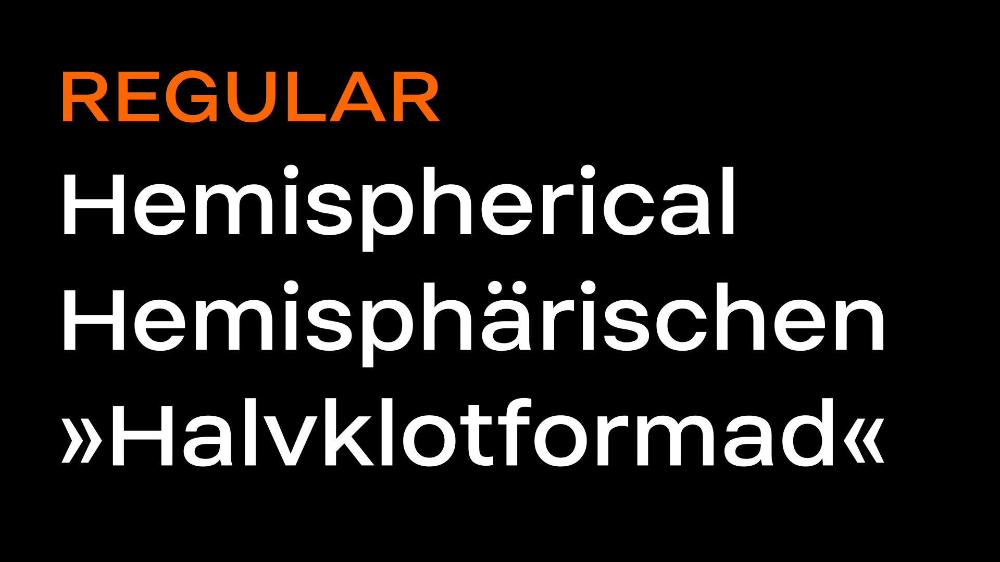
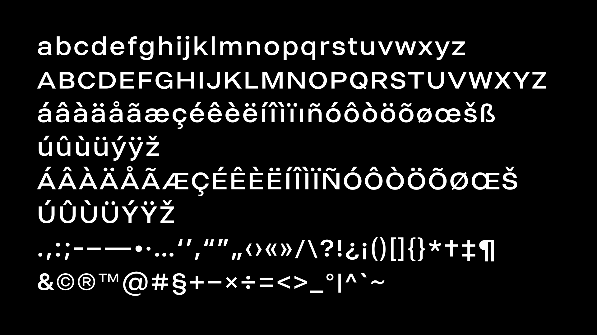
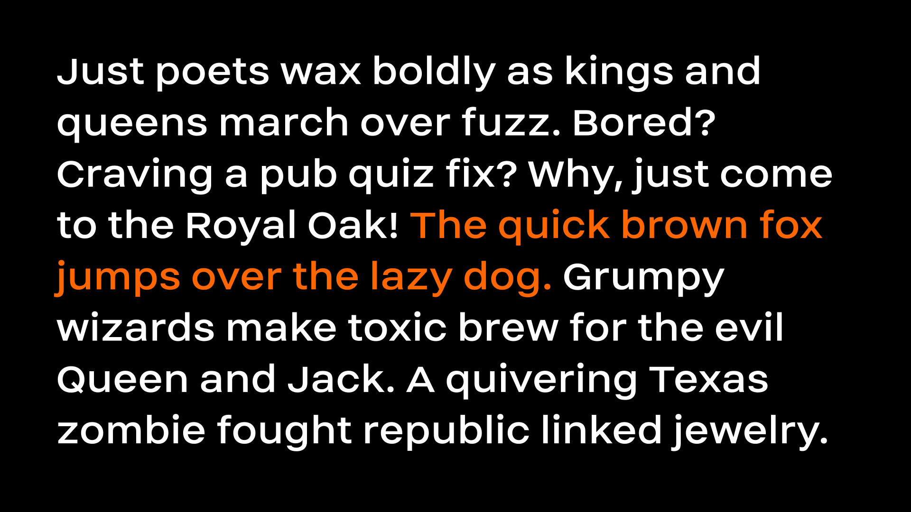

# Helmet

Helmet is a neo-grotesque display typeface, currently with a single font. It takes inspiration from Swiss classics like Helvetica and Univers but plays with proportions such as width and x-height to create a unique look and feel. Licensed under the [SIL Open Font License](http://scripts.sil.org/OFL_web), the font is available for free both for personal and commercial use.

Helmet is designed in the open source font editor [Birdfont](https://birdfont.org/). Birdfont is far from perfect but has worked out all right for this single-font typeface.

Feel free to [submit an issue](https://github.com/carlenlund/helmet/issues/new) for feature requests or if you find any errors.

**[Download latest release](https://github.com/carlenlund/helmet/releases)**

